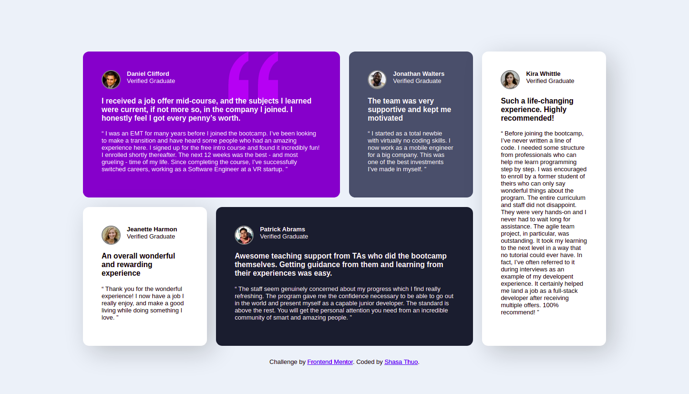

# Frontend Mentor - Testimonials grid section solution

This is a solution to the [Testimonials grid section challenge on Frontend Mentor](https://www.frontendmentor.io/challenges/testimonials-grid-section-Nnw6J7Un7). Frontend Mentor challenges help you improve your coding skills by building realistic projects. 


## Overview

### The challenge

Users should be able to:

- View the optimal layout for the site depending on their device's screen size

### Screenshot



### Links

- Solution URL: [Github](https://github.com/DevShasa/front-end-mentor/tree/main/testimonials-grid-section-main)
- Live Site URL: [Netlify](https://shasa-frontendmentor1.netlify.app/)

## My process

### Built with

- Semantic HTML5 markup
- CSS custom properties
- Flexbox
- CSS Grid


### What I learned

Using css grid

```css
    .container{
        display: grid;
        grid-template-columns: repeat(4, 1fr);
        grid-template-rows: repeat(2, auto);
        grid-gap: 1.5em;
    }
```

Media Querries
```css
@media (min-width: 375px){
    .container{
        display: flex;
        flex-direction: column;
    }
    .container * + * {
        margin-top: 1em;
    }
    body{
        margin: 2em;
    }
}
```


## Author

- Frontend Mentor - [@DevShasa](https://www.frontendmentor.io/profile/yourusername)
- Twitter - [@shasa_dev](https://www.twitter.com/shasa_dev)


